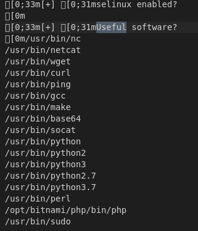
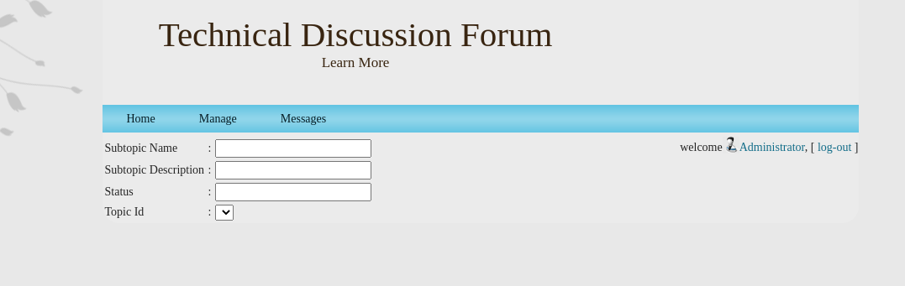

# Mission Steps Documented

*********************************

## Initial Set-up

SSH'd into the C2 Server to begin the mission. 

*****************************************

## Reconnaissance

### NMAP Scan for Network Enumeration

From the C2 server, initialized an NMAP scan. `nmap -sS -sV TARGETIP -p- > ./output/nmap.out`

From the output which can be seen in [nmap.out](output/nmap.out), the following information can be determined:

1. Port 22/tcp:
   1. Status: Open
   2. Service: ssh (OpenSSH 7.9p1 Debian 10+deb10u2 (protocol 2.0))
2. Port 80/tcp:
   1. Status: Open
   2. Service: http (OpenSSH 7.9p1 Debian 10+deb10u2 (protocol 2.0))
3. Port 443/tcp: 
   1. Status: Open
   2. Service: ssl/http (OpenSSH 7.9p1 Debian 10+deb10u2 (protocol 2.0))
4. Port 3306/tcp:
   1. Status: Closed
   2. Service: mysql
5. Port 8888/tcp:
   1. Status: Closed
   2. Service: sun-answerbook

In addition the follow information about infrastructure was noted:

1. OS: Linux
2. Hosted by AWS

### Visiting the HTTP service with a Browser

Using the ~~TOR mode~~ (initial connection was not made with TOR browser... all connections after were using TOR) of the Brave browser, connected to the targets http service to find it hosting a website. Considering that the building that I connected from is getting destroyed and it was from a dynamic IP, I'm not overtly concerned... just disappointed. Live and learn.

Website is extremely similar to the website from [before](https://github.com/Eldenwyre/probable-lamp#evaluating-the-webpage). All pages that are appearingly the same will be noted in [the section below](#pages-that-are-the-same). Any pages that have noticed differences will be noted after. It is important to note, the pages that are the same only refer to the pages when NOT LOGGED IN, this website now seems to have a functioning sign-in and sign-up unlike before.

#### Pages that are the same (without login)

For any listed here, if you want to see the previous report for reference, [go here](https://github.com/Eldenwyre/probable-lamp#evaluating-the-webpage).

1. About (aboutus.php)
2. Forum (unreg.php)
3. Contact (contact.php)
4. Message:  Still returns to Home
5. Foot Banner Links (All appear to go to the same page as previous)
   1. Contact Us
   2. Terms of Use
   3. Privacy Statement
   4. Online User

#### Home (index.php) (without login)

All appears to be the same outside of the login now being functional! This may be of use in the future. 

#### Sign-Up Page (register.php) (without login)

Now appears to be functional. I was able to make an account and successfully login on the home page after. Since this identity will be burned regardless, the information used can be found [here](output/userinfo.txt). This was for as much of my purpose as it was for yours. 

The email does not appear to recieve any email. 

#### Pages that are the same still (logged)

1. About
2. Contact
3. Foot Banner Links:
   1. Contact Us
   2. Terms of Use
   3. Privacy Statement

Note, that Message and Online User have changed, more below

#### Home (uhome.php) (logged)

Following the links on this page lead to nothing interesting

##### My Answered

Nothing interesting here.

##### My Question

Nothing interesting here.

#### Foot Banner: Online User (isuser.php)
Missing page (isuser.php)

Nothing interesting.

#### Clicking on User Name (uedit.php)

Missing page (uedit.php)

Nothing Interesting

#### Message

Interesting change now that we've logged in, we'll follow this and see where it goes

Searching for admin yields the following account

Opening the send message OR clicking on Administrator results in the page below

Upon sending the message this notification displays

I also sent the Max Matterson account from this qaz account, but I couldn't locate any message when logging back into the account.

#### Logout

Nothing Interesting here

### Enumerating with GoBuster

[Using this wordlist](https://raw.githubusercontent.com/3ndG4me/KaliLists/master/dirbuster/directory-list-lowercase-2.3-small.txt), GoBuster was used to scan for any potentially new directories that were not known from the previous version. This was launched from the C2 server with the following command. 

`gobuster -o output/gobuster.out -w /usr/share/wordlists/directory-list-lowercase-2.3-small.txt -U maxmatterson -P haxattax -u http://52.7.40.4/ -x .php`

This output can be found in the [gobuster.out file](output/gobuster.out)

************************************

## Weaponization

**********
I tried the same tried and true tactic from [last time](https://github.com/Eldenwyre/probable-lamp#finding-the-user-uploaded-files) despite being told it was patched in the briefing.

To test if for any whitelisting of files uploaded via sign-up, I uploaded a [showdown replay file](files/util-files/showdown.html)

It worked a little too well

This time around I attempted to use [this php shell](https://github.com/flozz/p0wny-shell)

It had not worked. The file ran but it couldn't execute

 

The same occured when checking if it was for a blacklist simple filter on kek.jpg.png.
`cd` was the only command I found that could work. kek.jpg.png was then edited to be a basic php command `<?php echo exec('ls')?>, but still no dice.

Some time passed, and I was toying with some ideas for an XSS attack to steal admin cookies, just some basic testing to see if I could have it exec (which an alert was successfully execed by having a user with the "Full Name" as `<script>alert("XSS"<\script>`

This attempt was successful but at this time was not utilized further. It runs on any page where the name was vulnerable: 

After recieving an alert that server resources were increased I decided I'd try again since the issue was it not being able to fork the process. It worked

### Interesting Files

#### APK in Locked Zip

Browsing into the directory above the ups directory, I saw an AppDeployment directory, this contained a single zip file. I copied the zip file to the ups directory and downloaded it through a tor connection on my browser. Opening the zip file, I see that there is a single APK. But it's password protected, tried using zip2john and running john on it but to no avail.

#### SQL file

In the db directory, which relative to ups is at `../db`, there was an [sql file](files/exfiled-files/tech_forum.sql) that may be of use in future 

> Future me: "It wasn't"

### Linpeas

Running linpeas didn't [result](files/exfiled-files/linPE) in too many of juicy things, there was a few things of note. More specifically that it liked the idea of using python:

### Snake Bite (Python Exploitation for Elevated Access)

Might as well check to see if we get free root...

Well, that's free root but it'd be nice to have full access through the shell. And on the first attempt too!
`python -c 'import subprocess; print(subprocess.check_output([COMMANDDATAHERE]))'` results in a root execution of the command within.

Continuing, checked out shadow with this method

Took that and ran it through john with [this password list](https://github.com/danielmiessler/SecLists/blob/master/Passwords/Common-Credentials/10-million-password-list-top-1000000.txt). And it cracked pretty quick.

Creds for jricho:
> User: jricho
> Pass: dreamer1

There are also bitnami credentials inside of the /home/bitnami directory that can be accessed this way

> User: bitnami?
> pass: BkmuowNTohD5

### Slithering into the mysql Server

Using the bitnami credentials I was able to access the mysql server

Access:

Database check:

Dump ([can be found here](files/exfiled-files/max.txt)):

Used [a converter shell script](files/util-files/conver.sh) from [this](/questions/489277/script-to-convert-mysql-dump-sql-file-into-format-that-can-be-imported-into-sqli) to convert the dump into a more [readable .sql format](files/max2.txt.sql).

When looking through the processed dump there were a few things that were noticed:

#### Visible Admin Credentials
The admin login credentials were visible in the user table dump: 

 (See [Admin Site View](#admin-site-view))

##### Admin Site View

With these credentials I was able to login to the site and view/access the following pages.

Everything appeared to be functionally the same from the admin standpoint outside of the new manage tab, in however it seemed primarily nonfunctional at this time. (I couldn't see the effect anywhere of any of the test forms I submitted)

While potentially useful in future, not useful for now

###### Home

###### Manage/Topic

###### Manage/Topic - Insert

###### Manage/Subtopic

###### Manage/Subtopic - Insert

###### Messages (And Everything Else)

All appeared to be the same (eg, the foot banners etc)

#### Chat Logs revealing pass

 (See)

With this password I was able to extract that [apkfile from earlier](#apk-in-locked-zip). See [below](#reversing-the-apk) for more info.

[Can be found here](files/exfiled-files/anarf-signup-test.apk)

## Reversing the APK

### Attempting to Run in A Virtual Android Device

After disconnecting the device from the internet, using android studio I attempted to run the apk after installing it with `adb install`; however, it would not function in the Nexus 5 device (using x86 most recent Android API version available)

### Locating C2

When using JADX to observe the extracted APK, noticed the following IP being hardcoded to fetch what appears to be busybox, which suggests this may be their C2 Server

It's likely 3.1\*\*.\*\*4.\*\*0 is being used as (at least part of) C2

### In-depth Reversal

[Found here](#in-depth-reversal-of-apk)

## Attempting to Gain Access on New C2

### Recon 

Conducting an nmap scan from our c2 resulted in the following: 

First scan was blocked, but using -Pn on a second scan worked.

1. Port 22/tcp:
   1. Status: Open
   2. Service: ssh   OpenSSH 8.2p1 Ubuntu 4ubuntu0.2 (Ubuntu Linux; protocol 2.0)
2. Port 6932/tcp:
   1. Status: Open
   2. Service: http    Node.js Express framework

In addition a GoBuster scan was run, which found the following 3 directories:

1. info
2. upload
3. download

## Delivery

## Exploitation

## Installation

## Command and Control

## Actions on Objective

*******************

# In Depth Reversal of APK